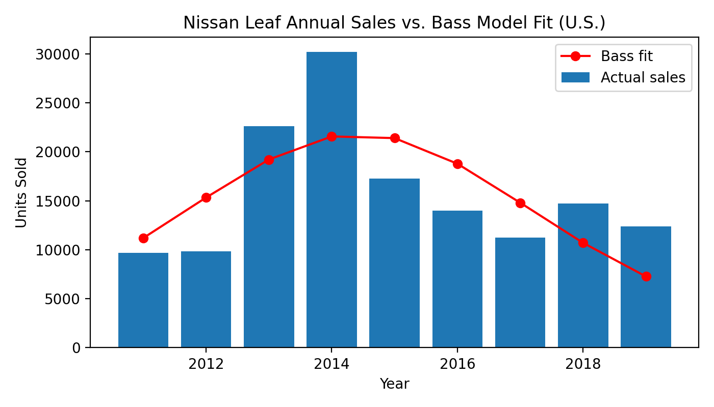
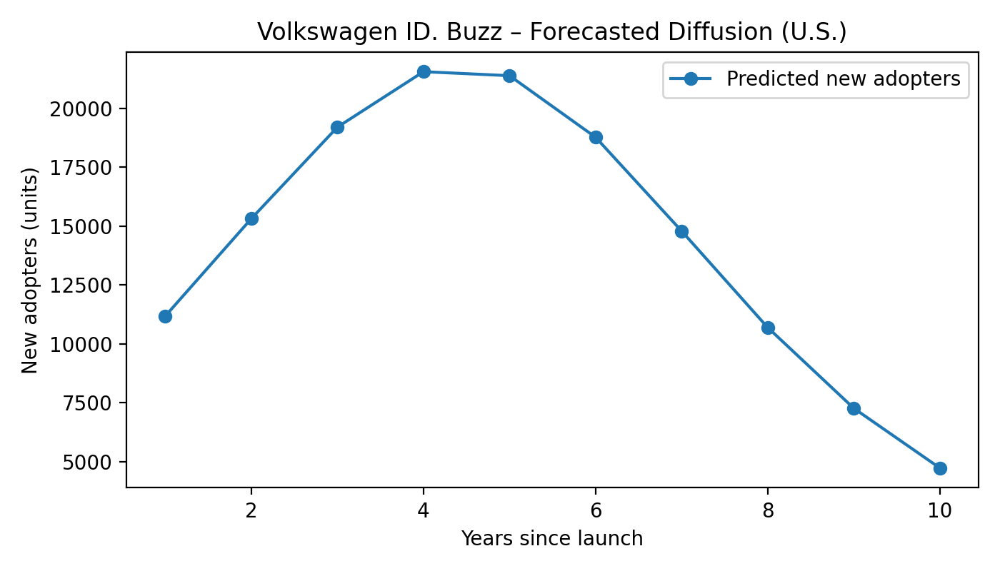

## Step 1: Choose an Innovation  

**Chosen innovation:** *Volkswagen ID. Buzz (2024)*  
**Source:** [TIME’s Best Inventions 2024 – Volkswagen ID. Buzz](https://time.com/collection/best-inventions-2024/)  

**Description:**  
The **Volkswagen ID. Buzz** is a fully electric reinterpretation of Volkswagen’s iconic Microbus, combining retro-inspired design with cutting-edge electric vehicle technology.  
Built on Volkswagen’s MEB platform, it offers sustainable zero-emission driving, advanced connectivity, and autonomous features in a spacious and versatile van format.  
Targeted at families, design enthusiasts, and environmentally conscious drivers, the ID. Buzz embodies the transition of electric mobility into the mainstream market, bridging nostalgia with innovation in the modern EV era.

## Step 2 — Chosen Analogue  
**Nissan Leaf (2010)**  

The *Nissan Leaf*, launched in 2010, was the world’s first mass-produced, fully electric vehicle designed for mainstream consumers.  
It pioneered large-scale adoption of electric cars and created the technological and behavioral foundation for later EV diffusion patterns.  
Both the Leaf and the **Volkswagen ID. Buzz** share the same innovation domain — battery-electric mobility — and target similar consumers who are transitioning from internal-combustion to sustainable transportation.

### Justification  
The **Volkswagen ID. Buzz** directly evolves from the technological pathway initiated by the **Nissan Leaf**, extending early EV innovation into a new segment: multi-purpose, design-centric electric vans.  
While the Leaf marked the *innovation* phase of the EV market, focused on compact commuter vehicles, the ID. Buzz represents the *imitation* and lifestyle-driven expansion stage.  
Both products illustrate successive waves in the diffusion of electric vehicles—early adoption followed by mainstream uptake.

From a diffusion-of-innovation perspective, the Leaf’s historical sales data (2011 – 2024) provide a strong empirical base for estimating Bass-model parameters (*p*, *q*, *M*).  
Its adoption curve reflects the dynamics of external influence (*innovation*) and internal influence (*imitation*) typical of emerging clean-tech markets.  
These estimated parameters can then be applied to forecast the expected market diffusion of the **Volkswagen ID. Buzz**, reflecting how consumer awareness and infrastructure maturity accelerate EV adoption.

## Step 3: Dataset for Bass Model  

**Dataset name:** *U.S. Plug-in Electric Vehicle Sales by Model*  
**Source:** [U.S. Department of Energy – Alternative Fuels Data Center (AFDC)](https://afdc.energy.gov/data/10567)  
**Reference citation:**  
U.S. Department of Energy, Alternative Fuels Data Center. (2024). *U.S. Plug-in Electric Vehicle Sales by Model [Data set]*. Retrieved from https://afdc.energy.gov/data/10567  

**Description:**  
This dataset provides annual U.S. sales figures for all plug-in electric vehicle models, beginning in 2011 and updated through 2024.  
Each record includes the vehicle’s make, model, type (BEV or PHEV), and annual sales units. For this project, the focus is on the **Nissan Leaf**, the first mass-market battery-electric vehicle used as the analogue for modeling the diffusion of the **Volkswagen ID. Buzz**.

**Relevant variables:**  
- `Year` - Calendar year of sales  
- `Make` - Manufacturer (e.g., Nissan)  
- `Model` - Vehicle name (e.g., Leaf)  
- `ElectricVehicleType` - Battery Electric Vehicle (BEV) or Plug-in Hybrid (PHEV)  
- `Sales (Units)` - Number of vehicles sold (new adopters, *at*)  

**Derived variables for analysis:**  
- `Cumulative Sales (At)` = Cumulative sum of `Sales (Units)`  
- `Market Potential (M)` = Estimated upper limit of adopters (derived from fit)  

**Usage:**  
This time-series dataset (2011–2024) will be used to estimate Bass-model parameters (*p*, *q*, *M*) for the Nissan Leaf.  
The estimated coefficients will then be applied to forecast the market diffusion of the **Volkswagen ID. Buzz (2024)**, reflecting the transition of electric mobility from early adopters to mainstream consumers.

## Step 4: Estimate Bass Model Parameters

**Procedure:**  
Using the U.S. Department of Energy’s *Plug-in Electric Vehicle Sales by Model* dataset, annual Nissan Leaf sales (2011–2019) were extracted and modeled using the **Bass Diffusion Model** via nonlinear least squares regression.

The Bass model equation:

\[
f(t) = \frac{(p+q)^2}{p} \cdot \frac{e^{-(p+q)t}}{\left[1 + \frac{q}{p} e^{-(p+q)t}\right]^2}
\]

where:
- \(p\) = coefficient of innovation  
- \(q\) = coefficient of imitation  
- \(M\) = market potential  

**Estimated parameters (Nissan Leaf, 2011–2019):**

| Parameter | Symbol | Estimate | Interpretation |
|------------|---------|-----------|----------------|
| Coefficient of innovation | \(p\) | **0.0488** | External influence (e.g., media, policy) |
| Coefficient of imitation | \(q\) | **0.4536** | Internal influence (word-of-mouth) |
| Market potential | \(M\) | **156,841 units** | Maximum potential adopters (U.S. market) |
| Peak adoption time | \(t^*\) | **almost equal to 4.44 years** | Time to maximum annual sales |

**Model Fit Visualization:**

- *Figure 1.* *Actual vs. Bass Model Predicted Sales for Nissan Leaf (2011–2019)*  
  

**Data Source:** leaf_fit_results.csv  
**Code File:** script.py  

---

## Step 5: Forecast for Volkswagen ID. Buzz (2024–2034)

Using the estimated parameters \((p=0.0488, q=0.4536)\) from the Nissan Leaf as an analogue, we forecasted the 10-year adoption curve for the **Volkswagen ID. Buzz**.  
Market potential \(M_{\text{target}}\) was initially assumed equal to the Leaf’s (\(156,841\)), reflecting a similar market scale in the early U.S. EV market.

**Forecast Results (Years since launch):**

| Year | Predicted New Adopters | Cumulative Adopters |
|------|------------------------|---------------------|
| 1 | 11,186 | 11,186 |
| 2 | 15,319 | 26,506 |
| 3 | 19,203 | 45,709 |
| 4 | 21,557 | 67,266 |
| 5 | 21,389 | 88,655 |
| 6 | 18,775 | 107,430 |
| 7 | 14,795 | 122,224 |
| 8 | 10,702 | 132,927 |
| 9 | 7,275 | 140,201 |
| 10 | 4,739 | 144,940 |

- *Figure 2.* *Forecasted Adoption Curve – Volkswagen ID. Buzz (U.S. Market)*  
  

**Data Source:** idbuzz_forecast.csv  
**Code File:** sript2.py  

## Step 6: Scope and Assumptions

**Scope:** United States (annual unit adopters).  
**Rationale:**  
The dataset and parameters originate from the U.S. EV market, ensuring internal consistency.  
While the ID. Buzz may eventually launch globally, applying U.S.-specific parameters allows for a reliable diffusion estimate based on real sales history.

**Assumptions:**
- Market potential \(M\) almost equal to Nissan Leaf’s early adoption capacity.  
- No major policy or supply-chain disruptions.  
- Similar consumer awareness and infrastructure conditions.

**Files Generated:**
- `bass_params.json` – estimated parameters (p, q, M, t\*)  
- `leaf_fit_results.csv` – historical model fit  
- `idbuzz_forecast.csv` – 10-year forecast results  
- `bass_fit_leaf.png` – fitted model chart  
- `idbuzz_forecast.png` – forecast curve chart  

## Step 7: Estimate Number of Adopters by Period

Using the estimated Bass parameters (\(p=0.0488,\ q=0.4536,\ M=156{,}841\)), the number of adopters was simulated over ten years following the product’s launch.  
The model predicts approximately **11 k** adopters in the first year, rising to a **peak of ~21 k** around year 4–5 before tapering off as the market approaches saturation.

| Year since launch | Predicted New Adopters | Cumulative Adopters |
|--------------------|-------------------------|----------------------|
| 1 | 11 186 | 11 186 |
| 2 | 15 319 | 26 506 |
| 3 | 19 203 | 45 709 |
| 4 | 21 557 | 67 266 |
| 5 | 21 389 | 88 655 |
| 6 | 18 775 | 107 430 |
| 7 | 14 795 | 122 224 |
| 8 | 10 702 | 132 927 |
| 9 | 7 275 | 140 201 |
| 10 | 4 739 | 144 940 |

**Interpretation:**  
The model estimates that adoption peaks between years 4–5, consistent with innovation diffusion theory.  
By year 10, approximately **145 k total adopters** are expected in the U.S. market.  
If broader demand or marketing accelerates uptake, \(M\) could expand further, shifting the curve upward.

## Insights

- The diffusion curve peaks around **year 4–5**, mirroring the Nissan Leaf’s lifecycle.  
- After the inflection point, adoption gradually slows as the market nears saturation.  
- Total cumulative adoption stabilizes around **145,000–155,000 units**, depending on actual market expansion.

- The ID. Buzz, positioned as a nostalgic yet eco-conscious EV, fits the imitation-driven adoption phase.  
- \(p < q\) indicates that **social influence** dominates over direct marketing or external stimuli—typical for mature green-tech products.  
- If Volkswagen scales production and leverages strong community branding, the effective \(M\) could increase significantly.

## References

- **TIME (2024).** *Volkswagen ID. Buzz.* In *TIME’s Best Inventions of 2024*.  
  Retrieved from [https://time.com/collection/best-inventions-2024/7094609/volkswagen-id-buzz/](https://time.com/collection/best-inventions-2024/7094609/volkswagen-id-buzz/)

- **U.S. Department of Energy – Alternative Fuels Data Center (AFDC).**  
  (2024). *U.S. Plug-in Electric Vehicle Sales by Model (2011–2024)* [Data set].  
  Retrieved from [https://afdc.energy.gov/data/10567](https://afdc.energy.gov/data/10567)
